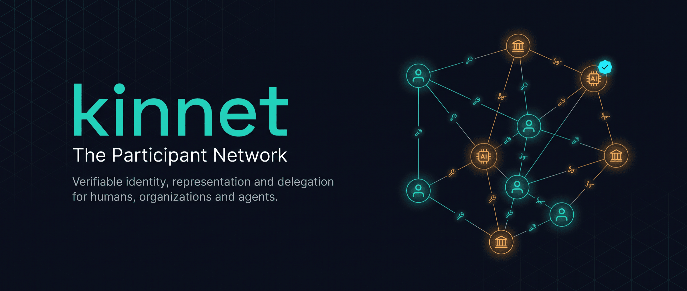
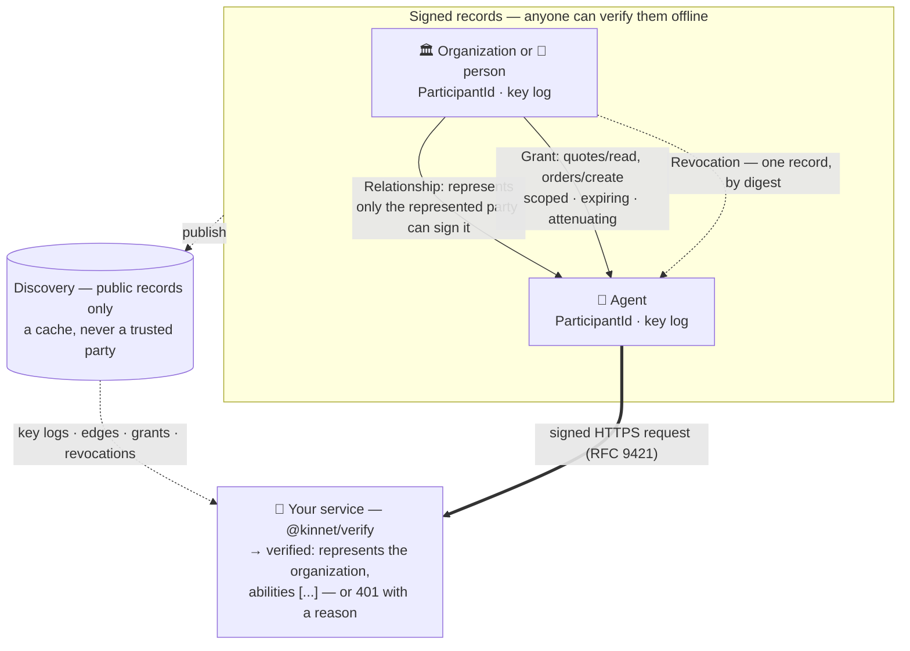
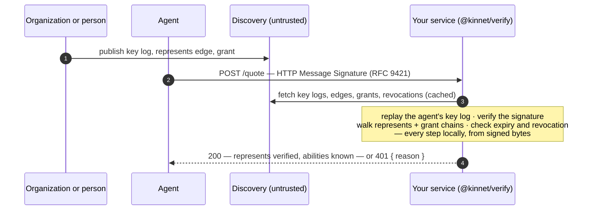

<p align="center">
  
</p>

<p align="center">
  <a href="https://github.com/HumanMeetsAi/kinnet/actions/workflows/check.yml"></a>
  <a href="./LICENSE"></a>
  <a href="./packages/protocol/spec/README.md"></a>
</p>

# Kinnet

**Kinnet** is the reference implementation of the
[**Participant Network**](./packages/protocol/spec/README.md): an open identity, relationship,
and authority layer for humans, organizations, applications, and AI agents.

It answers a question that nothing else on the internet answers today:

> **Does this agent really act for that organization — or that person — and what is it
> allowed to do, right now?**

Every participant — a person, a company, an application, an agent — has an identity that is a
self-certifying public key with an append-only key history, held by nobody but them. "This agent
represents me" and "it may do these things, until then" are signed records the represented
party issues, and can withdraw with one more record. Anyone can verify all of it offline, from
the bytes, without calling the issuer, without trusting a registry, without a blockchain, and
without opening an account anywhere. A directory is a convenience, never a trusted party.

## The problem

AI agents now act on behalf of both **businesses** and **people** — placing orders, requesting
quotes, booking, negotiating, answering, paying. Whoever receives an agent's request needs to
know **who it acts for and what it is allowed to do, right now** — and whoever sends one needs
a way to say so that strangers can check. Neither side has that today. The two cases look
different and share one root cause.

### The business case

Your API, shop, or service is starting to receive real traffic from agents. Before you act on a
request — quote a price, accept an order, release data — you need to know which organization
stands behind the agent and what that organization allows it to do. Nothing the agent can
present answers that:

- **An API key** proves a billing account.
- **An OAuth token** proves a login to some platform.
- **An A2A agent card** advertises capabilities — unsigned, with no issuer behind the claims.
- **Enterprise IAM** (Entra, Okta, …) says what an agent may do _inside_ the organization that
  runs it, and nothing at all to the counterparty receiving its requests.
- **The agent's own profile** saying "I work for Acme" is worth exactly nothing.

So businesses fall back on allowlists, shared secrets, and hope — the conditions under which
agent impersonation and over-claiming thrive. And the moment an agent is decommissioned, a key is
lost, or a contractor's mandate ends, there is no way to tell every counterparty at once.

The same organization has the mirror-image problem when it _sends_ agents out: it wants to tell
every counterparty "this agent is ours, it may do these things, until this date" — without an
integration project per counterparty, and with a way to take it back.

### The personal case

You send an agent to book a table, buy a ticket, negotiate a repair, or reply to your mail. You
want to say _"this one is mine, and this is all it may do"_ in a way the other side can check —
so instead the agent gets your full login to every platform it touches, and each of those
becomes a place it can be impersonated or over-reach. You cannot scope it, and you cannot revoke
it everywhere at once.

Underneath that: you have no identity of your own on the network. You have accounts — each
issued and owned by a platform, none able to vouch for anything outside that platform. Nobody
who knows you — an employer, a professional body, a community — can say so in a form you carry
with you and a stranger can verify. Losing a phone means losing access to your identity, not
just a device. And private conversation between people is readable by whoever runs the server in
the middle.

### What would answer both

**The represented party itself — company or person — over its own signature**, stating that
this agent represents it and holds these specific abilities until this date; a way to
**withdraw** that at any moment that every verifier sees; and a way for **any** counterparty —
one that has never heard of the issuer, on infrastructure the issuer does not run — to check all
of it from the records alone. Underneath, an identity that belongs to its holder and not to any
platform.

That is what the Participant Network specifies, and what this repository implements.

## How it works

Every participant — a person, an organization, an application, an agent — is the same kind of
thing: a keypair with an append-only **key log** (rotation and recovery without a registrar).
Everything else is a signed record between participants. The diagram shows an organization or a
person standing behind an agent; the records are identical either way:



A request is verified end to end without trusting anyone in the middle:



- **Identity** — a `ParticipantId` is derived from the inception key event of an Ed25519 key
  log with pre-rotation (KERI-style): a stolen active key cannot take over the identity, and
  rotation and recovery need no registrar.
- **Representation** — a `Relationship` (`represents`, `operates`, `member-of`, …) is a signed
  edge; only the represented party's signature counts. `Claim`s are signed attributes about a
  participant. Both are one-hop, public, expiring, revocable.
- **Authority** — a `Grant` delegates scoped abilities (UCAN-aligned). Chains attenuate hop by
  hop and never amplify; a verifier walks them by digest.
- **Revocation** — one `Revocation` record, naming the revoked record's digest, withdraws
  authority; verification flips everywhere within a cache window.
- **Requests** — every request carries an RFC 9421 HTTP Message Signature over method, URL,
  body digest, and time. Verifying it is a middleware.
- **Discovery** — a directory of public records only. It can withhold or delay, but it cannot
  forge a record or bind your id to a key you did not sign — so you can run your own, use
  anyone's, or cache one, and the guarantees do not change.

## For services: verify an agent request in a few lines

```bash
npm install @kinnet/verify
```

```ts
import express from "express";
import { createVerifier } from "@kinnet/verify";
import "@kinnet/verify/express"; // opt-in: types `req.verifiedAgent`

const app = express();
const kinnet = createVerifier({
  discoveryUrl: "https://discovery.example.com",
  requireRepresents: "pk_z…" // the organization whose agents you accept
});

app.use(express.raw({ type: "*/*" })); // the middleware needs the raw body bytes
app.use(kinnet.middleware());
app.post("/quote", (req, res) => res.json({ agent: req.verifiedAgent }));
```

An accepted request carries `req.verifiedAgent = { agentId, actor, delegated, abilities, … }` —
`actor` is the signing principal, and the request only got here because a `represents` edge for
the organization you named was found, issued and signed by that organization, unexpired and
unrevoked. A rejected one ends in `401 { error: "unauthorized_agent", reason }` naming exactly
what failed. There is deliberately no "which organization?" lookup — anyone can publish edges
about an agent, so you name the organization and the verifier proves the claim. Nothing here
calls the organization, and discovery is only ever a cache. See
[`@kinnet/verify`](./packages/verify) for the full surface, including edge runtimes.

## For people: an identity that is yours, and agents that stay in bounds

Nothing above is specific to companies. A person on the network holds their own identity — a
key they generate, keep, rotate, and recover themselves, with no account and no issuer — and
the same records work for them:

- **Your agents act for you, within limits.** A `Grant` from you to your agent says exactly what
  it may do and until when; a counterparty checks it the same way it checks a company's. Revoke
  it and every verifier sees that within a cache window.
- **Your devices are not your identity.** A browser or phone holds a short-lived session key
  under a scoped grant ([011](./packages/protocol/spec/011-device-key-grants.md)); losing the
  device is one revocation, not identity loss, and the root key never lives in the least
  trustworthy runtime you touch.
- **Others can vouch for you** — an employer, a professional body, a community you belong to —
  as signed `Claim`s and `Relationship`s you carry with you, checkable by strangers, expiring
  and revocable, without the issuer being on the path.
- **Private conversation stays private.** Messaging between participants
  ([010–014](./packages/protocol/spec/README.md)) has a machine lane that is authenticated
  plaintext, and a human lane that is end-to-end encrypted with MLS — unreadable by any node
  operator, and surviving you adding a second device.
- **Communities are first-class.** A node run for a community — an organization, an interest
  group, a neighbourhood — hosts a member directory, events, a library, boards
  ([006](./packages/protocol/spec/006-module-config.md)); membership is a signed edge, and what
  a member discloses to whom is the member's decision, not the operator's.

The node that hosts messaging and communities is not part of this repository yet; the specs
are.

## Design principles

- **Verify from bytes.** Every guarantee is checked locally from signed records. No trusted
  party, no phone-home, no chain.
- **One participant model.** Humans, organizations, applications, and agents are the same kind of
  thing — first-class peers in one graph — so an agent can represent a person as easily as a
  company, a person can vouch for an organization, and an organization can be a member of
  another. Nobody is a "user" of somebody else's system.
- **Compose, don't invent.** JCS canonicalization, Ed25519, multibase/multihash, RFC 9421
  signatures, RFC 9530 content digests, UCAN-shaped delegation, MLS for encryption. The protocol
  fixes how they fit; it does not mint new cryptography.
- **Interop, not competition.** A2A agent cards, MCP servers, and enterprise IAM are peers to
  bridge, not rivals — Kinnet supplies the identity, relationship, and authority layer those
  rails assume but do not provide. [`@kinnet/a2a`](./packages/a2a) is the first bridge.
- **Brand-neutral wire.** Everything an independent implementation must emit or match uses the
  neutral `pn` prefix, never a product name; the protocol outlives its first implementer.
- **Thin and evolving.** Spec [000](./packages/protocol/spec/000-protocol-scope.md) admits only
  what two independent implementations must agree on, and — before the wire freeze — prefers
  replacing a flawed primitive over accreting compatibility on top.

## What is what

- **The Participant Network** is the protocol: the numbered specifications in
  [`packages/protocol/spec`](./packages/protocol/spec) together with the committed conformance
  vectors that back them. It is defined by those documents and bytes, not by this code, and it
  is written to be implemented independently: everything a compatible implementation must agree
  on is in the specs and checkable against the vectors alone.
- **Kinnet** is the reference implementation — the packages in this repository. Where the spec
  and this code disagree, that is a bug in one of them, and the conformance vectors decide
  which.
- **The network** is whatever participants operate. Nothing here grants this repository's
  authors a privileged position in it: a directory built from these packages is a convenience
  anyone can run, and every guarantee a verifier relies on is checked from signed bytes, not
  from trusting an operator.

## About this repository

This is the **published surface** of Kinnet: the protocol specs, the record schemas, and the
verification code a third party needs in order to check a Kinnet identity, represents chain or
grant chain without trusting anyone. It is exported per release from a private upstream
repository.

That means the export is one-directional: development happens upstream, history here is the
export history, and a pull request is never merged in place — but it is reviewed here, and an
accepted change is ported upstream with your authorship preserved and ships in the next export.
Per-package changelogs are not mirrored; each release's notes are published on this
repository's GitHub release for its tag.
[CONTRIBUTING.md](./CONTRIBUTING.md) has the mechanics for bug reports, protocol proposals, and
pull requests; anything security-sensitive goes through [SECURITY.md](./SECURITY.md), never a
public issue.

## Packages

| Package                                   | What it is                                                                                             |
| ----------------------------------------- | ------------------------------------------------------------------------------------------------------ |
| [`@kinnet/protocol`](./packages/protocol) | Record types and Zod schemas: identities, key-event logs, claims, relationships, grants, revocations   |
| [`@kinnet/crypto`](./packages/crypto)     | Ed25519, JCS canonicalization, participant-ID derivation, key logs with pre-rotation, RFC 9421 signing |
| [`@kinnet/trust`](./packages/trust)       | The resolver: represents chains, claims, and UCAN-aligned grant chains, verifiable offline             |
| [`@kinnet/verify`](./packages/verify)     | Inbound-request verification for services receiving agent traffic (Node/Express and edge runtimes)     |
| [`@kinnet/a2a`](./packages/a2a)           | Bridge between Kinnet participant records and A2A agent cards                                          |

All five are on npm — `npm install @kinnet/verify` (or `crypto`, `trust`, `protocol`, `a2a`) —
as `0.x` early-adopter releases: the wire freezes at 1.0, not before, so record shapes may still
change between minors. Track the spec, and pin versions.

## Specs and interoperability

The normative protocol lives in [`packages/protocol/spec`](./packages/protocol/spec) — one
numbered RFC per primitive, starting with
[000, which governs what may enter the protocol at all](./packages/protocol/spec/000-protocol-scope.md).
Where bytes are signed or hashed, the spec is backed by committed conformance vectors under
`packages/*/test/fixtures` that an independent implementation can check from bytes alone.

Those vectors are the compatibility contract. The protocol is meant to be implemented widely,
and two implementations that produce and accept the committed vectors — the accepting and the
rejecting cases both — interoperate by construction; nothing about compatibility is negotiated
against this codebase or any operator. If you are building an implementation and a vector seems
wrong, underspecified, or missing, that is a protocol issue and exactly the kind of issue this
repository wants.

The protocol is pre-wire-freeze: the specs may still change, and spec 000 defines what a change
requires (an RFC, a reference implementation, and reference tests, together). The freeze is
declared, not triggered — it is marked by the 1.0 release of these packages, no earlier than the
first independent implementation that passes the vectors — and from then on the discipline is
additive-only. Everything published before that is `0.x`, for early adopters, and may change.

## Try it live

A live discovery instance operated by the maintainers answers at
`https://discovery.kinnet.humanmeetsai.com`. It is one instance among any — running your own
from these packages is the point, not the exception — and it is **experimental, best-effort
infrastructure**: rate-limited, no SLA, and it may reset before 1.0. Don't build anything you
can't afford to re-enroll.

**1. Prove the build.** The commit is stamped at image build time and matches a release tag of
this repository:

```bash
curl -s https://discovery.kinnet.humanmeetsai.com/version
```

**2. Read real records.** Three participants live on the directory: **HumanMeetsAI**, the
company that authored the protocol and maintains this repository; **An Lu**, its founder, who holds his own key; and
the **operator agent** HumanMeetsAI runs. Everything about them is a signed record — the profile
signed by the participant, the edges and claims signed by whoever issued them:

```bash
# the organization: its signed profile, and the key-event log its id derives from
curl -s https://discovery.kinnet.humanmeetsai.com/participants/pk_zQmY3jDEWRfTnaEmRg773xoVieVabRDG1cvFabnr7uYrvip
curl -s https://discovery.kinnet.humanmeetsai.com/participants/pk_zQmY3jDEWRfTnaEmRg773xoVieVabRDG1cvFabnr7uYrvip/key-log

# the founder: what HumanMeetsAI says about him — member-of, and a role claim — over its own signature
curl -s https://discovery.kinnet.humanmeetsai.com/participants/pk_zQmTDqHZKz4CyiPYoKFfspD2Y1FFPdWPKEJmWSJqntjbd2j/relationships
curl -s https://discovery.kinnet.humanmeetsai.com/participants/pk_zQmTDqHZKz4CyiPYoKFfspD2Y1FFPdWPKEJmWSJqntjbd2j/claims

# the agent: HumanMeetsAI says it represents it, and operates it
curl -s https://discovery.kinnet.humanmeetsai.com/participants/pk_zQmUd4qFEDUSjqAfbDuiWp2rcsXwZYLUwGMKtjxJtip9ynb/relationships
```

None of that needs an account, and none of it is trusted because discovery served it — which
is what the next step shows.

**3. Verify it yourself, from bytes.** Run the same resolution a relying party performs — replay
the key log, check the id derives from it, verify the profile's signature against the current
key, and verify every relationship and claim against the key state of whoever issued it, resolved
from that issuer's own log. No checkout needed:

```bash
npx @kinnet/verify pk_zQmTDqHZKz4CyiPYoKFfspD2Y1FFPdWPKEJmWSJqntjbd2j
```

or, from a checkout of this repository after `pnpm install && pnpm build`, the same thing as a
readable script:

```bash
pnpm exec tsx examples/verify.mts pk_zQmTDqHZKz4CyiPYoKFfspD2Y1FFPdWPKEJmWSJqntjbd2j
```

```
✔ pk_zQmTDqHZKz4… derives from its inception keys (1 event(s), threshold 1)
✔ profile signed by the current key: "An Lu" (person)
✔ "An Lu" member-of "HumanMeetsAI", issued by "HumanMeetsAI" pk_zQmY3jDEWRf… (signature valid, not expired)
✔ claim role = "founder", issued by "HumanMeetsAI" pk_zQmY3jDEWRf… (signature valid, not expired)
```

An agent's authority is a grant chain it presents alongside its requests; discovery never stores
it, only its revocation. The chain the agent above presents is committed here as
[`examples/records/humanmeetsai-operator-agent.grants.json`](./examples/records/humanmeetsai-operator-agent.grants.json)
— verify it, and watch what a single flipped byte does to the profile check:

```bash
pnpm exec tsx examples/verify.mts pk_zQmUd4qFEDUSjqAfbDuiWp2rcsXwZYLUwGMKtjxJtip9ynb --grants examples/records/humanmeetsai-operator-agent.grants.json
pnpm exec tsx examples/verify.mts pk_zQmUd4qFEDUSjqAfbDuiWp2rcsXwZYLUwGMKtjxJtip9ynb --tamper
```

`--discovery <url>` points either at your own instance. Nothing in them phones home: every check
is a signature or a digest computed locally over the bytes fetched.

**4. Mint your own.** Self-custodial — the keys never leave your machine. Save this as `me.mts`
(in a checkout, at the repository root; or anywhere after `npm install @kinnet/crypto`) and run
`npx tsx me.mts`:

```ts
import { createIdentity, signRequest } from "@kinnet/crypto";

const me = createIdentity();
const url = `https://discovery.kinnet.humanmeetsai.com/participants/${me.id}/key-log`;
const body = JSON.stringify(me.log);
const headers = signRequest({
  method: "PUT",
  url,
  body,
  keyId: me.id,
  secretKey: me.currentKeys[0].secretKey
});
const response = await fetch(url, {
  method: "PUT",
  headers: { "content-type": "application/json", ...headers },
  body
});
console.log(response.status, me.id);
```

Then `npx @kinnet/verify <your id>` — and keep the secret key if you want the identity to stay
yours: rotation, recovery, and everything else in the specs works from it.

## Build and test

Requires Node 22+ and pnpm (the version is pinned in `package.json` via `packageManager`;
`corepack enable` will honour it).

```bash
pnpm install
pnpm check     # build, typecheck, and run every package's suite
```

Individually:

```bash
pnpm build     # tsc per package, in dependency order
pnpm typecheck # build, then type-check sources and tests
pnpm test      # build, then vitest per package
```

Packages resolve each other through their built `dist/`, which is why `build` runs first.

## License

Apache-2.0. See [LICENSE](./LICENSE).
